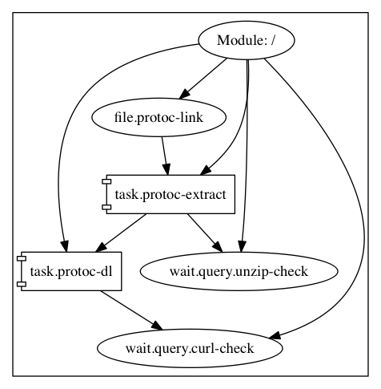
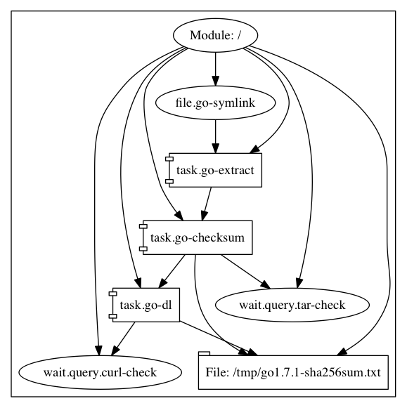
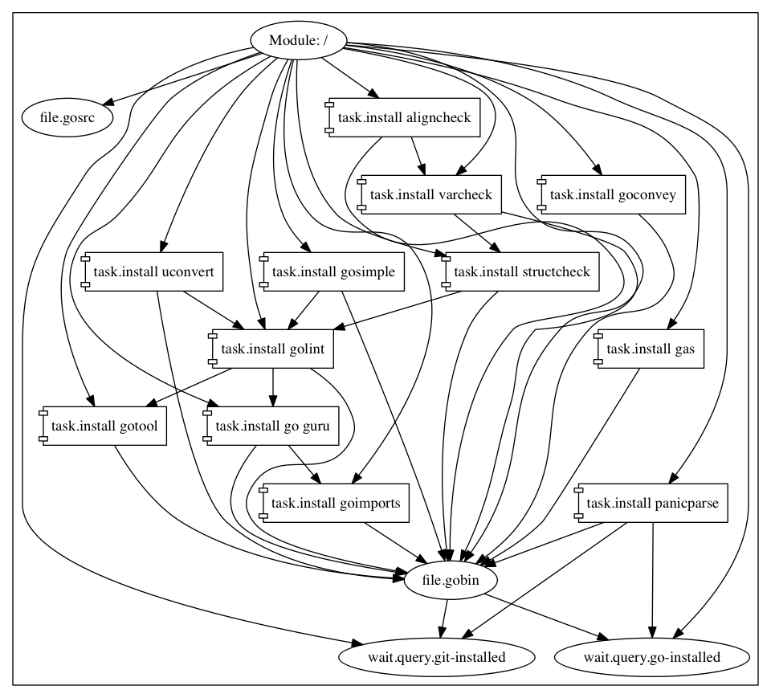
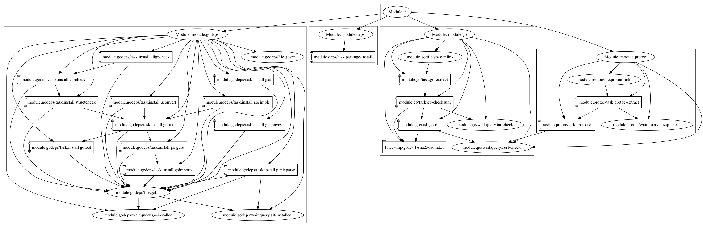
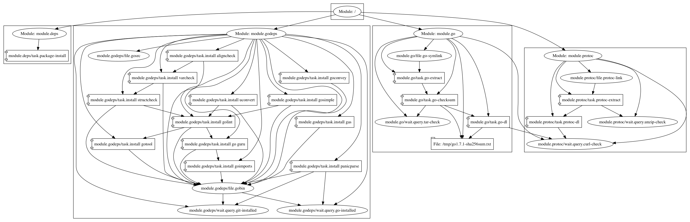

# converge-builder

A converge sample that sets a go build environment for converge. After installing these modules, you should be able
to compile converge.

## Usage

Download converge from the [releases](https://github.com/asteris-llc/converge/releases) page. Then
run the following commands based on your platform:

### Running on CentOS/Redhat/Fedora

```shell
$ converge apply --local converge-centos.hcl
...
```

### Running on Debian/Ubuntu

```shell
$ converge apply --local converge-deb-ubuntu.hcl
...
```

## Graphs

### protoc

[protoc.hcl](./protoc.hcl) installs Protocol Buffers.



### go.hcl

[go.hcl](./go.hcl) downloads and installs the go compiler.



### godeps.hcl

[godeps.hcl](./godeps.hcl) installs the go binaries to `$HOME/go`.



### Architecture
The `converge-*` files install packages and import `go.hcl`,
`godeps.hcl` and `protoc.hcl`.

#### Debian/Ubuntu

[converge-deb-ubuntu.hcl](./converge-deb-ubuntu.hcl)



#### CentOS/Redhat/Fedora

[converge-centos.hcl](./converge-centos.hcl)


