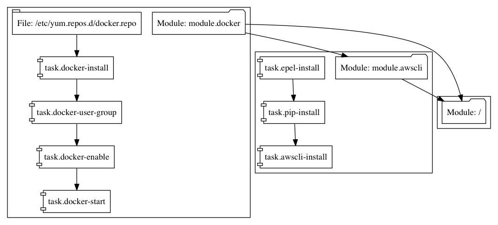
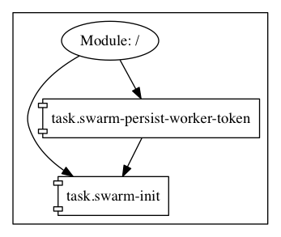
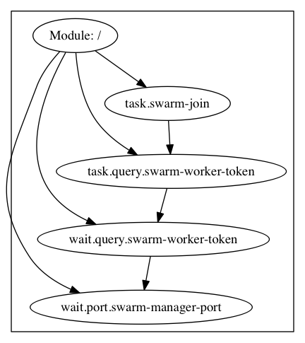

# converge-docker-swarm

A converge sample that sets up a multi-node [Docker Swarm Mode](https://docs.docker.com/engine/swarm/) cluster on AWS.

## Usage

### Terraform (AWS)

You must have a version of the [Converge Terraform provisioner](https://github.com/asteris-llc/terraform-provisioner-converge) built and configured as a plugin for terraform:

```shell
$ cat ~/.terraformrc
provisioners {
  converge = "/path/to/terraform-provisioner-converge"
}
```

You must have also set valid [AWS credentials](https://www.terraform.io/docs/providers/aws/index.html) (`AWS_ACCESS_KEY_ID` and `AWS_SECRET_ACCESS_KEY`) in your environment. Then you can run:

```
terraform apply
```

When terraform provisioning completes, you should have a Docker Swarm mode cluster running with a single manager node and 2 (by default) worker nodes. If you want to change the number of worker nodes, you can update the `worker-count` variable in [main.tf](./main.tf).

After the provisioning is complete, you should be able to ssh into your leader node and run docker swarm commands:

```shell
$ ssh centos@$(terraform output manager-ip)

[centos@ip-10-0-1-239 ~]$ docker node ls
ID                           HOSTNAME       STATUS  AVAILABILITY  MANAGER STATUS
4omysuebc73ixajlymum3rrvp    ip-10-0-1-40   Ready   Active
8dkplbxr7xluoyf0s91jumrr9 *  ip-10-0-1-239  Ready   Active        Leader
b1k1r5hx9xe4ek34azbdx0ghe    ip-10-0-1-186  Ready   Active
```

## Graphs

### main.hcl

[main.hcl](./converge/main.hcl) is applied to all nodes:



### manager

[manager.hcl](./converge/manager.hcl) is applied to manager nodes:



### worker

[worker.hcl](./converge/worker.hcl) is applied to worker nodes:



## Notes

This example uses the terraform graph engine to coordinate the timing of joining worker nodes to the cluster. The manager and worker nodes are created and provisioned in parallel. Then, using a [null_resource](https://www.terraform.io/docs/provisioners/null_resource.html), we join the workers to the cluster after the manager is initialized.

At this time, this example does not support provisioning multiple manager nodes.

This example uses an S3 bucket with a private acl to share the Swarm join token to worker nodes. Once provisioning is complete, you may want to rotate the token so that the one stored on S3 is no longer valid. You can do this by running the [`docker swarm join-token --rotate worker`](https://docs.docker.com/engine/reference/commandline/swarm_join_token/) command on your Swarm mode cluster after provisioning is complete.
