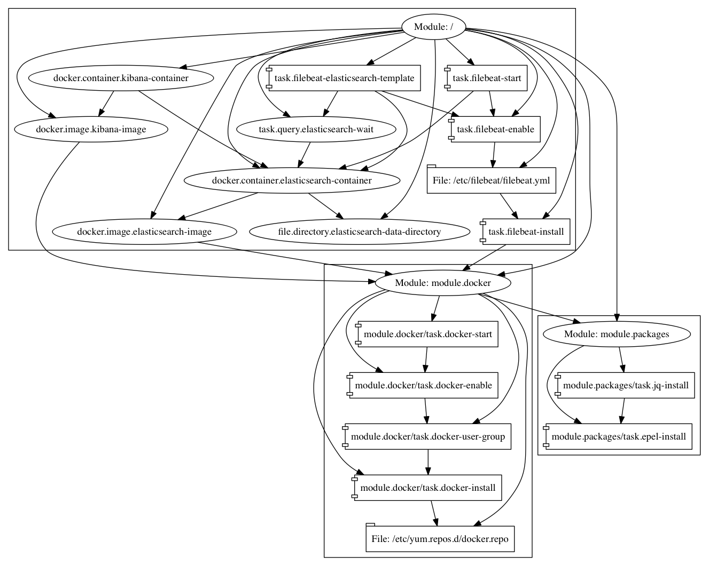

# converge-elk

The [ELK stack](https://www.elastic.co/webinars/introduction-elk-stack) is
traditionally composed of
[Elasticsearch](https://www.elastic.co/products/elasticsearch),
[Logstash](https://www.elastic.co/products/logstash), and
[Kibana](https://www.elastic.co/products/kibana) and is a great solution for
collecting, searching, and visualizing logs. In this example, we are configuring
a docker-based ELK stack. However, since this is a single-node demonstration, we
are using [Filebeat](https://www.elastic.co/products/beats/filebeat) instead of
Logstash for the log collection component.

## Usage

### Vagrant

Just run `vagrant up`!

After Vagrant provisioning completes, you should have a working Kibana instance
backed by Elasticsearch. Filebeat is installed on the Vagrant host and is
configured to send logs to Elasticsearch. You should be able to access the
Kibana web interface at [http://localhost:5601](http://localhost:5601).

### Terraform (AWS)

You must have a version of the
[Converge Terraform provisioner](https://github.com/ChrisAubuchon/terraform-provisioner-converge)
built and configured as a plugin for Terraform:

```shell
$ cat ~/.terraformrc
provisioners {
  converge = "/path/to/terraform-provisioner-converge"
}
```

You must have also set valid
[AWS credentials](https://www.terraform.io/docs/providers/aws/index.html)
(`AWS_ACCESS_KEY_ID` and `AWS_SECRET_ACCESS_KEY`) in your environment. Then you
can run:

```
terraform apply
```

After provisioning completes, you should be able to retrieve the url for the
Kibana interface by running:

```shell
echo "http://$(terraform output ip):5601/"
```

## Graphs

This is the visualization of the graph that Converge applies to the system.



## Warning

When deploying via Terraform, Kibana will be publicly accessible on port 5601
without authentication. You can adjust the security group in `main.tf` to change
this behavior.
