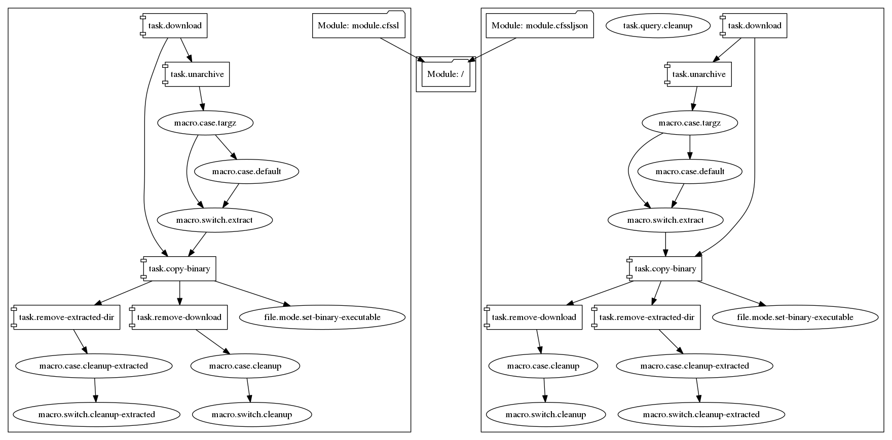
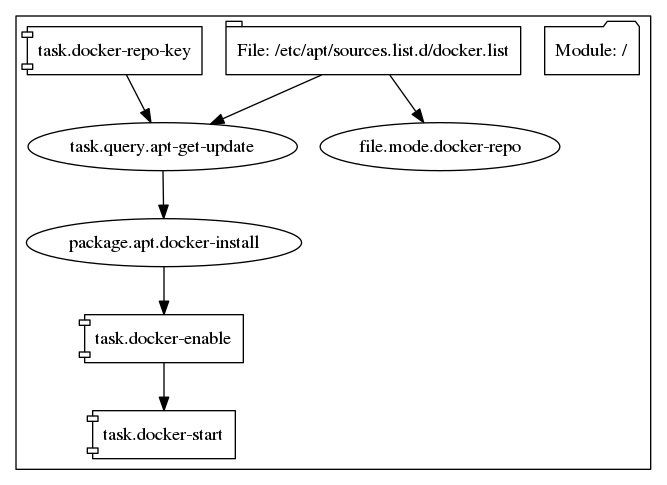
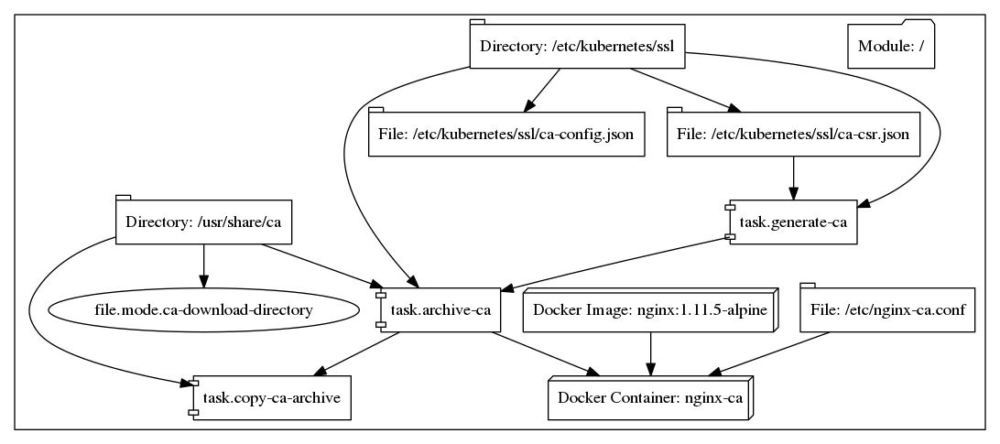
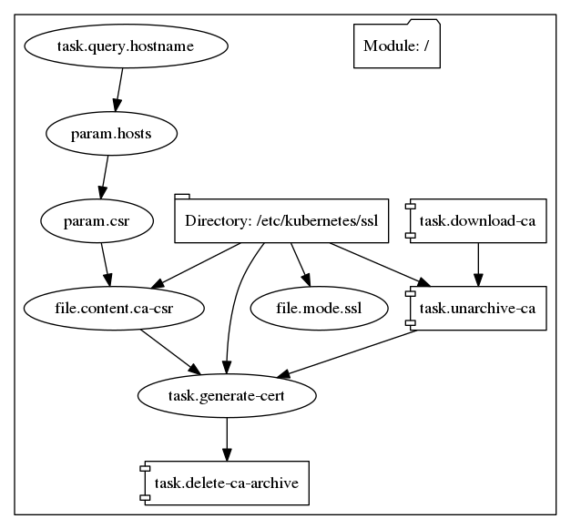
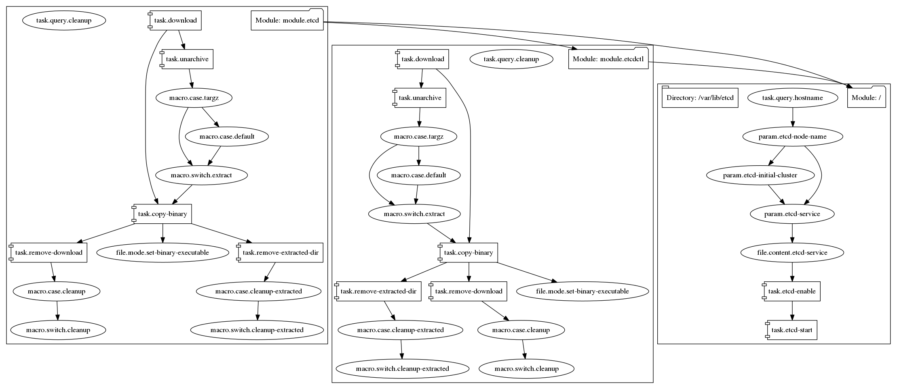
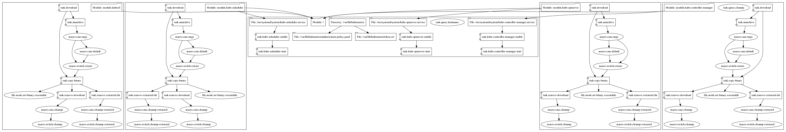
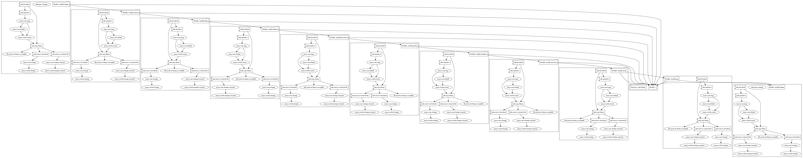
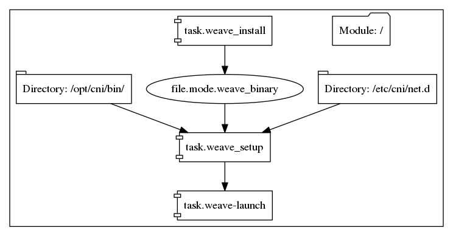
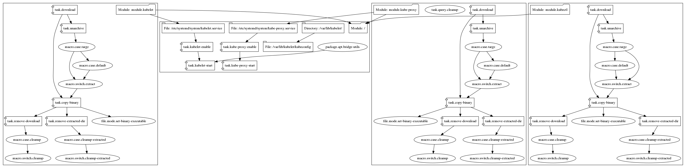

# converge-kubernetes

A converge example that sets up an HA Kubernetes cluster based on [kubernetes-the-hard-way](https://github.com/kelseyhightower/kubernetes-the-hard-way).

## Usage

This example is supported on Linux and OSX hosts.

### Vagrant

Just run `vagrant up`!

The first time you run `vagrant up`, converge will be downloaded and executed from your `/tmp` directory (by default). Converge will generate a certificate authority on your local machine and upload it to the vagrant instances. From that point forward, a vagrant provisioner will run converge to configure the instances and install all of the necessary Kubernetes components. By default, a Kubernetes cluster consisting of a single controller and 2 nodes will be created. You can configure the `CONTROLLER_COUNT` to 3+ nodes to run an HA cluster. That number of worker nodes can be configured using the `NODE_COUNT` variable.

If vagrant provisioning fails (the example pulls various resources from the internet and is sensitive to network issues), you can repeatedly run `vagrant provision` and `vagrant up` until all nodes are fully provisioned.

*Note: Vagrant 1.8.6+ is required.*

### Configuring kubectl

You can SSH into a controller instance (`vagrant ssh controller-1`, for example) and run kubectl from there. If you want to run kubectl from your host machine, you can run the following steps from the `examples/kubernetes` directory.

```shell
vagrant ssh controller-1 -c "sudo cat /etc/kubernetes/ssl/ca.pem" > ca.pem

kubectl config set-cluster converge-kubernetes \
  --certificate-authority=./ca.pem \
  --embed-certs=true \
  --server=https://172.19.9.21:6443

kubectl config set-credentials converge-kubernetes-admin --token chAng3m3

kubectl config set-context converge-kubernetes \
  --cluster=converge-kubernetes \
  --user=converge-kubernetes-admin

kubectl config use-context converge-kubernetes
```

If you have customized the IP addresses or admin token defined in the [Vagrantfile](./Vagrantfile), you should change the `--server` and `--token` options respectively.

### Terraform (AWS)

You must have a version of the [Converge Terraform provisioner](https://github.com/asteris-llc/terraform-provisioner-converge) built and configured as a plugin for Terraform:

```shell
$ cat ~/.terraformrc
provisioners {
  converge = "/path/to/terraform-provisioner-converge"
}
```

You must have also set valid [AWS credentials](https://www.terraform.io/docs/providers/aws/index.html) (`AWS_ACCESS_KEY_ID` and `AWS_SECRET_ACCESS_KEY`) in your environment. Then, from the `terraform/aws` directory, you can run:

```
terraform plan
terraform apply
```

#### Configuring kubectl

You can SSH into a controller instance and run kubectl from there. If you want to run kubectl from your host machine, you can run the following steps from the `examples/kubernetes/terraform/aws` directory.

```shell
export CONTROLLER_IP=$(terraform output controller_ips | tail -n1)
ssh ubuntu@$CONTROLLER_IP sudo cat /etc/kubernetes/ssl/ca.pem > ca.pem

kubectl config set-cluster converge-kubernetes \
  --certificate-authority=./ca.pem \
  --embed-certs=true \
  --server=https://$CONTROLLER_IP:6443

kubectl config set-credentials converge-kubernetes-admin --token chAng3m3

kubectl config set-context converge-kubernetes \
  --cluster=converge-kubernetes \
  --user=converge-kubernetes-admin

kubectl config use-context converge-kubernetes
```

If you have customized the admin token defined in [variables.tf](./terraform/aws/variables.tf), you should change `--token` option.

## Graphs

cfssl:



docker:



generate-ca:



generate-cert:



etcd:



kubernetes-controller:



cni:



weave:



kubernetes-node:




## Warning

This example is intended to demonstrate the power of converge for provisioning complex infrastructure but the resulting Kubernetes cluster should not be considered production-ready. There are a number of missing components such as a logging infrastructure, front-end load balancer, and cloud-provider integration that are outside the scope of this example.
